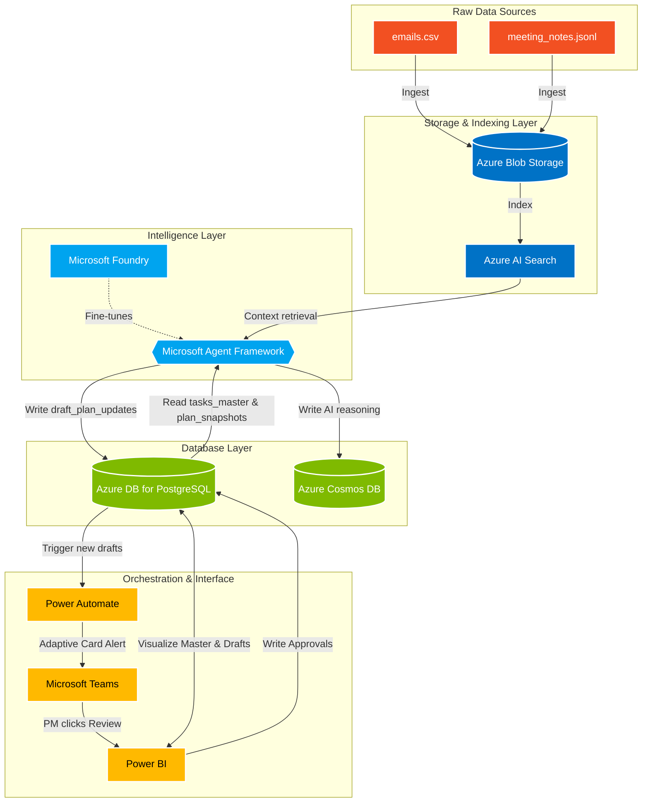

# AURORA 

**Bridging the gap between unstructured conversations and structured project plans.**

## 📌 Executive Summary

### The Problem
In complex delivery environments, official project plans (e.g., Gantt charts, schedules) often fall out of sync with reality. The "truth" of what changed, shifting dates, new dependencies, or reassigned owners—actually lives in unstructured formats like meeting discussions, email threads, and informal updates. Manually maintaining these plans creates immense overhead for Project Managers, leading to weak governance and avoidable rework.

### The Solution
**AURORA (Assisted Update Review Of Resource Allocation)** is an Agentic AI solution built on the Microsoft Stack. It acts as a lightweight planning assistant that listens to unstructured project conversations (emails, meeting transcripts) and converts them into structured planning updates. 

Critically, this is a **Human-in-the-Loop** system. The AI does not overwrite the master plan; instead, it drafts proposed updates into an "Approvals Queue" for the Project Manager to review via Power BI and Microsoft Teams, ensuring accountability and trust.

---

## 🏗 Enterprise Architecture (Microsoft Stack)

This solution is designed to scale across the enterprise using the mandated Microsoft and Azure tools.

### 1. Ingestion & Storage Layer
*   **Azure Blob Storage:** Acts as the raw data lake landing zone for unstructured files (`emails.csv`, `meeting_notes.jsonl`).
*   **Azure AI Search:** Indexes the unstructured text from Blob Storage, making it instantly searchable for the LLM to retrieve context.

### 2. Database Layer
*   **Azure Database for PostgreSQL:** The relational core. It houses the current baseline (`tasks_master.csv`), historical data (`plan_snapshots.csv` for delta detection), and the AI-generated `draft_plan_updates`.
*   **Azure Cosmos DB:** Provides an immutable audit trail, logging the Agent's reasoning, source evidence, and confidence scores for compliance.

### 3. Intelligence Layer
*   **Microsoft Agent Framework:** The orchestrator that retrieves search context and uses LLMs to extract structural updates (Date Shifts, New Tasks, Owner Updates).
*   **Microsoft Foundry:** Utilized to fine-tune and evaluate models specifically on engineering and project management terminology.

### 4. Orchestration & Human-in-the-Loop Interface
*   **Power Automate:** The workflow engine. When new drafts are generated, it triggers an Adaptive Card alert to the PM.
*   **Microsoft Teams:** Allows PMs to receive alerts and approve/reject simple changes directly in chat.
*   **Power BI:** The comprehensive dashboard for the Project Manager, visualizing the "Current State" baseline against the AI-generated "Approvals Queue."

---

## 🧩 Architecture Flow



---

## 💻 The Proof of Concept (Local Prototype)

To prove the core intelligence of the Agent Framework, this repository contains a functional prototype of the extraction engine. 

The Python script `extract_plan_updates.py` simulates the Microsoft Agent Framework. It ingests the unstructured `meeting_notes.jsonl` and `emails.csv` datasets, parses the natural language for task updates, and outputs a structured `draft_plan_updates.csv` representing the "Approvals Queue."

### How to Run the Prototype

1. Ensure you have Python 3 installed.
2. Verify that `meeting_notes.jsonl` and `emails.csv` are in the root directory.
3. Run the extraction script:
   ```bash
   python3 extract_plan_updates.py
   ```
4. The script will generate a `draft_plan_updates.csv` file containing over 480 structured updates (e.g., Status Updates, Date Shifts, New Tasks) with confidence scores and source evidence.

### Dashboard Visualization
To view the Human-in-the-Loop experience, open Power BI Desktop and import both `tasks_master.csv` (the baseline) and `draft_plan_updates.csv` (the AI drafts) to visualize the Approvals Queue.
