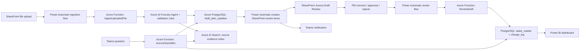

# AURORA
**Assisted Update Review Of Resource Allocation**

AURORA is a Microsoft-stack project planning assistant that turns unstructured project communications into structured, reviewable plan updates. It helps project managers keep official trackers, schedules, and Gantt views aligned with what is actually discussed in emails, meeting notes, and informal updates.

## Problem

In complex delivery environments, the official project plan often falls out of sync with reality. Updates about new tasks, shifted dates, blockers, owner changes, and dependencies are usually buried in meeting notes or email threads. Unless a project manager manually updates the tracker, the plan becomes stale.

AURORA addresses this by extracting planning signals from unstructured text and converting them into draft updates. The system is intentionally human-in-the-loop: AI never directly overwrites the official plan.

## Solution

AURORA ingests project emails and meeting notes, extracts structured planning updates, stores them as draft updates, and routes them to a SharePoint review queue. Project managers can approve, reject, or correct each draft before it updates the official `tasks_master` table. Every approval and rejection is recorded in `change_log` for auditability.

## Core Capabilities

- Extracts updates from `emails.csv` and `meeting_notes.jsonl`
- Detects new tasks, owner changes, due-date shifts, status updates, blockers, and ambiguity
- Matches extracted updates against existing `tasks_master` tasks
- Generates draft updates with confidence, source evidence, and clarification questions
- Routes drafts to a SharePoint human review queue
- Updates `tasks_master` only after PM approval
- Records approved and rejected decisions in `change_log`
- Sends Teams notifications when review items are ready
- Supports Power BI reporting for master plan, draft queue, and audit trail
- Supports Teams bot questions backed by PostgreSQL and Azure AI Search

## Architecture


```mermaid
flowchart LR
  A["SharePoint file upload"] --> B["Power Automate ingestion flow"]
  B --> C["Azure Function: IngestUploadedFile"]
  C --> D["Azure AI Foundry Agent + validation rules"]
  D --> E["Azure PostgreSQL: draft_plan_updates"]
  D --> S["Azure AI Search: source evidence index"]
  E --> F["Power Automate creates SharePoint review items"]
  F --> G["SharePoint: Aurora Draft Review"]
  F --> H["Teams notification"]
  G --> I["PM corrects / approves / rejects"]
  I --> J["Power Automate review flow"]
  J --> K["Azure Function: ReviewDraft"]
  K --> L["PostgreSQL: tasks_master + change_log"]
  L --> M["Power BI dashboard"]
  N["Teams question"] --> O["Azure Function: AuroraTeamsBot"]
  O --> E
  O --> L
  O --> S

```

---

## 💻 The Proof of Concept (Local Prototype)

To prove the core intelligence of the Agent Framework, this repository contains a functional prototype of the extraction engine. 

The Python script `extract_plan_updates.py` simulates the Microsoft Agent Framework. It ingests the unstructured `meeting_notes.jsonl` and `emails.csv` datasets, parses the natural language for task updates, and outputs a structured `draft_plan_updates.csv` representing the "Approvals Queue."

### How to Run the Prototype

1. Ensure you have Python 3 installed.
2. Verify that `meeting_notes.jsonl` and `emails.csv` are in the root directory.
3. Run the extraction script:
   ```bash
   python3 extract_plan_updates.py
   ```
4. The script will generate a `draft_plan_updates.csv` file containing over 480 structured updates (e.g., Status Updates, Date Shifts, New Tasks) with confidence scores and source evidence.

### Dashboard Visualization
To view the Human-in-the-Loop experience, open Power BI Desktop and import both `tasks_master.csv` (the baseline) and `draft_plan_updates.csv` (the AI drafts) to visualize the Approvals Queue.


