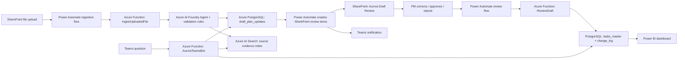

# AURORA
**Assisted Update Review Of Resource Allocation**

AURORA is a Microsoft-stack project planning assistant that turns unstructured project communications into structured, reviewable plan updates. It helps project managers keep official trackers, schedules, and Gantt views aligned with what is actually discussed in emails, meeting notes, and informal updates.

## Problem

In complex delivery environments, the official project plan often falls out of sync with reality. Updates about new tasks, shifted dates, blockers, owner changes, and dependencies are usually buried in meeting notes or email threads. Unless a project manager manually updates the tracker, the plan becomes stale.

AURORA addresses this by extracting planning signals from unstructured text and converting them into draft updates. The system is intentionally human-in-the-loop: AI never directly overwrites the official plan.

## Solution

AURORA ingests project emails and meeting notes, extracts structured planning updates, stores them as draft updates, and routes them to a SharePoint review queue. Project managers can approve, reject, or correct each draft before it updates the official `tasks_master` table. Every approval and rejection is recorded in `change_log` for auditability.

## Core Capabilities

- Extracts updates from `emails.csv` and `meeting_notes.jsonl`
- Detects new tasks, owner changes, due-date shifts, status updates, blockers, and ambiguity
- Matches extracted updates against existing `tasks_master` tasks
- Generates draft updates with confidence, source evidence, and clarification questions
- Routes drafts to a SharePoint human review queue
- Updates `tasks_master` only after PM approval
- Records approved and rejected decisions in `change_log`
- Sends Teams notifications when review items are ready
- Supports Power BI reporting for master plan, draft queue, and audit trail
- Supports Teams bot questions backed by PostgreSQL and Azure AI Search

## Architecture


```mermaid
flowchart LR
  A["SharePoint file upload"] --> B["Power Automate ingestion flow"]
  B --> C["Azure Function: IngestUploadedFile"]
  C --> D["Azure AI Foundry Agent + validation rules"]
  D --> E["Azure PostgreSQL: draft_plan_updates"]
  D --> S["Azure AI Search: source evidence index"]
  E --> F["Power Automate creates SharePoint review items"]
  F --> G["SharePoint: Aurora Draft Review"]
  F --> H["Teams notification"]
  G --> I["PM corrects / approves / rejects"]
  I --> J["Power Automate review flow"]
  J --> K["Azure Function: ReviewDraft"]
  K --> L["PostgreSQL: tasks_master + change_log"]
  L --> M["Power BI dashboard"]
  N["Teams question"] --> O["Azure Function: AuroraTeamsBot"]
  O --> E
  O --> L
  O --> S

```

---
## Microsoft Stack

### Active Services

- **Microsoft Foundry / Azure OpenAI**  
  Used for AI-assisted extraction and reasoning over project updates.

- **Azure Functions**  
  Hosts the backend APIs:
  - `IngestUploadedFile`
  - `IngestProjectData`
  - `ReviewDraft`
  - `GetPendingDrafts`
  - `SearchEvidence`
  - `AuroraTeamsBot`
  - `BuildInfo`

- **Azure Database for PostgreSQL**  
  Structured system of record for:
  - `tasks_master`
  - `draft_plan_updates`
  - `change_log`
  - `people`
  - `dependencies`
  - `plan_snapshots`

- **Power Automate**  
  Orchestrates file ingestion, SharePoint review item creation, Teams notifications, approval/rejection flows, and Power BI refresh.

- **SharePoint Lists**  
  Human-in-the-loop review and correction interface.

- **Microsoft Teams**  
  Notification channel and conversational interface for AURORA.

- **Power BI**  
  Reporting layer for master plan, draft review queue, Gantt-style views, and audit history.

- **Azure AI Search**  
  Indexes raw source evidence from uploaded emails and meeting notes, enabling searchable audit support.

- **GitHub**  
  Source control and submission repository.

### Optional / Future Services

- **Azure Blob Storage**  
  Can be used as a raw document archive/data lake.

- **Azure Cosmos DB**  
  Not required in the current MVP because auditability is handled in PostgreSQL `change_log`.

## Data Flow

1. A project file is uploaded to SharePoint.
2. Power Automate reads the file and calls `IngestUploadedFile`.
3. The Azure Function parses email or meeting-note records.
4. AURORA extracts plan updates using deterministic rules and Azure AI Foundry fallback.
5. Raw source records are indexed into Azure AI Search.
6. Extracted updates are validated against source evidence.
7. Matching logic checks whether each update relates to an existing task.
8. Drafts are inserted into `draft_plan_updates`.
9. Power Automate creates rows in the SharePoint `Aurora Draft Review` list.
10. Teams notifies the PM that review items are ready.
11. The PM approves, rejects, or corrects drafts in SharePoint.
12. Power Automate calls `ReviewDraft`.
13. Approved drafts update `tasks_master`.
14. Approved and rejected decisions are recorded in `change_log`.
15. Power BI visualizes the latest project plan and audit trail.

## Human-In-The-Loop Review

AURORA does not directly update the official plan. Every extracted update becomes a draft first.

Drafts include:

- draft ID
- project ID
- source ID
- update type
- matched task ID
- proposed change summary
- confidence
- source evidence
- clarification question
- review status

The PM can:

- approve a clean draft
- reject an irrelevant draft
- correct task ID, owner, due date, or status
- retry failed submissions after fixing correction fields

Failed submissions are visible in SharePoint through `flow_status` and `flow_error`, so PMs do not need to inspect Power Automate run logs.

## PostgreSQL Tables

### `tasks_master`

Official project plan table. Updated only after human approval.

### `draft_plan_updates`

AI-generated draft updates awaiting review or already reviewed.

### `change_log`

Audit trail for approved and rejected decisions.

Approved updates record field-level changes:

```text
change_type
field_changed
old_value
new_value
reviewed_by
source_evidence
comments
```

Rejected updates record:

```text
change_type = REJECTED
field_changed = No official plan change
old_value = NULL
new_value = NULL
reviewed_by
comments
```

### `plan_snapshots`

Used for baseline/current comparison and future delta detection.

### `dependencies`

Stores task dependency relationships for sequencing and Gantt-style views.

### `people`

Stores team member metadata for owner matching and future assignment recommendations.

## SharePoint Review Queue

The SharePoint list `Aurora Draft Review` acts as the PM review desk.

Recommended columns:

```text
Title                  draft ID
project_id
source_id
update_type
task_title
proposed_change
review_status
confidence
source_evidence
clarification_question
matched_task_id
corrected_task_id
corrected_owner_name
corrected_due_date
corrected_status
decision
review_notes
flow_status
flow_error
```

`decision` choices:

```text
Pending
Approve
Reject
```

`corrected_status` choices:

```text
No change
Not started
In progress
Blocked
Done
```

`flow_status` choices:

```text
Waiting for review
Processing
Completed
Failed
```

## Teams Bot Capabilities

AURORA can answer operational project questions using PostgreSQL and Azure AI Search.

Example questions:

```text
Aurora, why was D00043 created?
Aurora, show pending approvals for PRJ001.
Aurora, show blocked tasks.
Aurora, show change log for T00065.
Aurora, what changed this week?
Aurora, search evidence about coordination model.
```

Known draft IDs and task IDs are answered deterministically from PostgreSQL. Broader source-evidence questions use Azure AI Search.

## Power BI Dashboard

The Power BI report contains three primary views.

### 1. Master Plan

- current tasks from `tasks_master`
- task status distribution
- blocked tasks
- upcoming deadlines
- Gantt-style timeline

### 2. AI Draft Review

- pending drafts
- drafts needing clarification
- approved/rejected review history
- confidence levels
- source evidence

### 3. Change Log

- approved task changes
- rejected AI draft decisions
- reviewer
- old/new values
- source evidence
- comments


